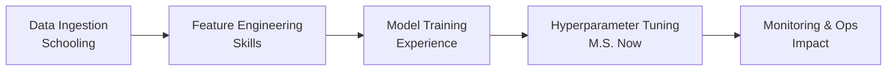

# Hi, I'm Thejes Raj Gangadhar — turning data into decisions

> Data Scientist | ML Engineer | M.S. in Data Science (in progress)  
> Designing, training, and deploying models that deliver measurable impact.

---

## 🔧 My Story as an ML Pipeline

### 📥 Data Ingestion = Schooling

- B.E. in Computer Science & Engineering, Visvesvaraya Technological University, Bangalore, India — 2019–2023
  - Relevant Coursework: Python, Java, DBMS, Big Data, Cloud Computing, NLP, Data Structures
- M.S. in Data Science (in progress), San Jose State University, San Jose, USA — 2024–2026
  - Relevant Coursework: Data Warehouse & Pipeline, Distributed Systems, Machine Learning, Big Data Technologies

### 🧪 Feature Engineering = Skills

**Programming:** Python • Java • C • SQL • R • JavaScript • HTML/CSS • Shell scripting  
**ML & DS:** Logistic Regression • Random Forest • SVM • K-Means • PCA • A/B Testing • Pandas • Numpy • Scikit-learn • TensorFlow • Keras • PyTorch • OpenCV  
**Generative AI & LLMs:** LLMs • RAG • LangChain • OpenAI  
**DevOps:** Docker • Kubernetes • Jenkins • Terraform • CI/CD  
**Cloud & Big Data:** AWS (EC2, S3, Lambda, SageMaker) • GCP • Azure • Snowflake • Databricks • Apache Spark  
**Other:** Git • GitHub • GitLab

### 🧠 Model Training = Experience

- Research Assistant — Wilkin Lab, SJSU (Oct 2024 – Feb 2025)
  - Applied clustering & anomaly detection on remote sensing data, reducing manual effort −15%
  - Enhanced fire risk classification with predictive models, improving precision

- Data Scientist — Handlkart (May 2023 – Aug 2024)
  - Built recommendation system (collaborative + content-based), boosting sales +15%
  - Automated ETL & preprocessing (Python/SQL), cutting manual work −30% and reporting latency −22%
  - Collaborated on ML pipelines for deployment, reducing latency −18%

- Software Development Intern — Nexturn India Pvt Ltd (Dec 2022 – May 2023)
  - Built interactive React website with advanced component architecture
  - Automated backend processes (Python/Java), optimizing performance for scalable apps

### ⚙️ Hyperparameter Search = M.S. (Now)

Currently pursuing my M.S. in Data Science, focusing on scalable ML, distributed systems, and retrieval‑augmented generation. Open to internships, research collaborations, and applied ML roles.

### 🚀 Currently Learning

- MLOps
- LLMOps  
- RAG (Retrieval-Augmented Generation)

### 📈 Monitoring & Ops = Impact

- Customer sales uplift +15% (recommendation system)
- Reporting latency −22% (ETL optimization)
- Manual effort reduced −15% (research automation)

---

## 🧪 Selected Experiments (Projects)

- Internal Knowledge Assistant with LLM & RAG (Jan 2025)
  - Built Q&A assistant with RAG for internal docs, cutting support load −16%
  - `LangChain • OpenAI • Streamlit`

- San Francisco Crime Pattern Analysis (Nov 2024)
  - Designed ETL pipelines in Airflow + Snowflake, improving processing time −25% and decision‑making efficiency
  - `Airflow • dbt • Snowflake • Power BI`

- Containerized Travel Website Deployment (May 2023)
  - Developed scalable web app with Docker + Jenkins CI/CD, reducing deployment errors −75%
  - `Docker • Jenkins • CI/CD`

---

## 📚 Publications

- Implementing a Travel Website using Dockers — Mat Journals (Sep 2023)

---

## 🛠️ Tech Stack & Tools

---

## 📊 GitHub Stats & Activity

---

## 📫 Contact & Links

- 💼 **LinkedIn:** [linkedin.com/in/thejesraj](https://linkedin.com/in/thejesraj)
- 🐙 **GitHub:** [github.com/Gthejesraj](https://github.com/Gthejesraj)
- 📧 **Email:** [gthejesraj@gmail.com](mailto:gthejesraj@gmail.com)
- 📍 **Location:** San Jose, CA

---

## 🚀 Let's Connect!

I'm always open to discussing new opportunities, collaborations, or just chatting about tech! Feel free to reach out if you'd like to:
- 🤝 Collaborate on ML/Data Science projects
- 💡 Discuss emerging technologies in AI/ML
- 🎯 Explore internship or research opportunities
- ☕ Grab a virtual coffee and chat about tech

---

  
  
  
  ---
  
  *Last updated: January 2025*
  

 